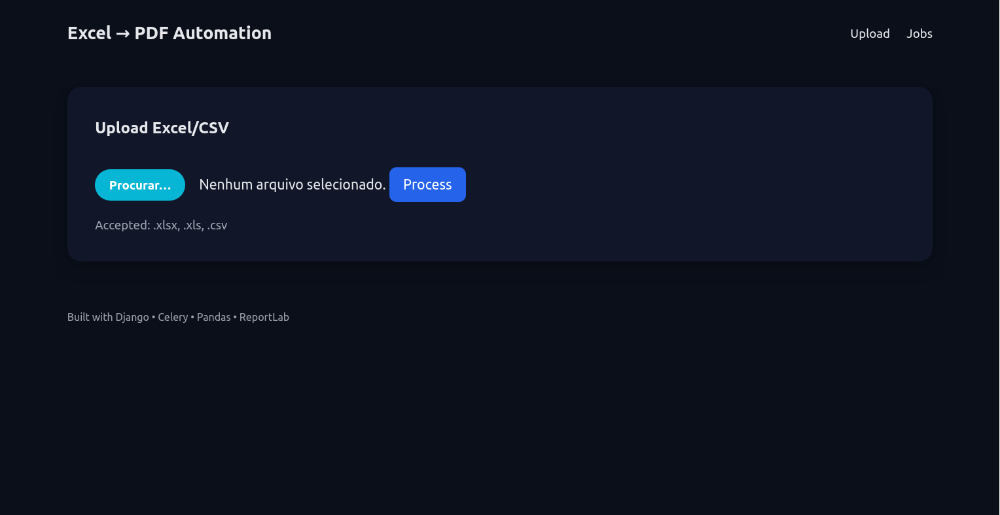
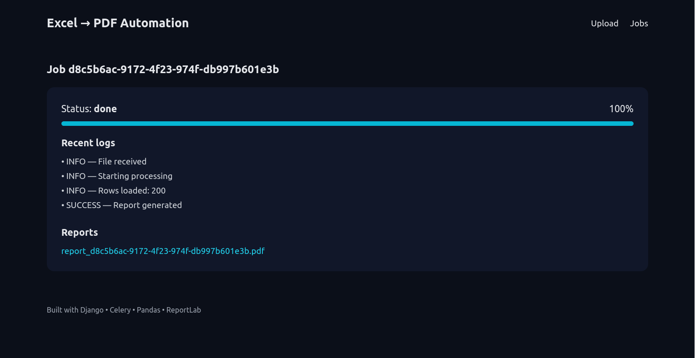
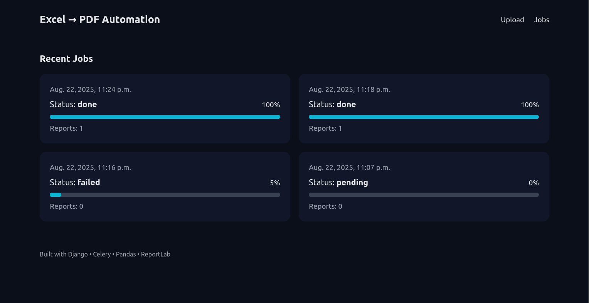

# 📊 Excel → PDF Automation (Django + Pandas + Celery)

Convert **Excel/CSV datasets** into **structured PDF reports** with validation, background processing and logs.  
Perfect for automating report generation in data-heavy workflows.

---

## 🚀 Tech Stack
- **Backend:** Django, Django REST Framework  
- **Async Processing:** Celery + Redis  
- **Data Handling:** Pandas  
- **PDF Generation:** ReportLab + Matplotlib (charts)  
- **Database:** PostgreSQL  
- **Deploy:** Docker  

---

## ✨ Features
✅ Upload Excel/CSV files (drag & drop)  
✅ Validation & error logging  
✅ Background jobs with Celery  
✅ Progress tracking with live status updates  
✅ Professional PDF output (metrics + charts)  
✅ Dark theme design (portfolio-ready)  

---

## 🖥️ Quickstart (Local)

```bash
# Install dependencies
pip install -r requirements.txt

# Run migrations
python manage.py migrate

# Start Redis (local or Docker)
redis-server
# or
docker run -p 6379:6379 redis:7

# Start Celery worker
celery -A project worker -l info

# Run Django server
python manage.py runserver
```

Then open: http://127.0.0.1:8000

---

## 📸 Screenshots

### Base


### Upload


### jobs


📄 [Download a sample PDF report](docs/sample_report.pdf)

---

## 📌 Use Cases
- Healthcare / Biotech reports (patient data → PDF)  
- Finance dashboards (Excel → structured reports)  
- Enterprise workflows automation  
- Any repetitive reporting task that needs background processing  

---

## 📄 License
MIT